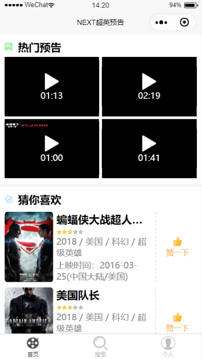
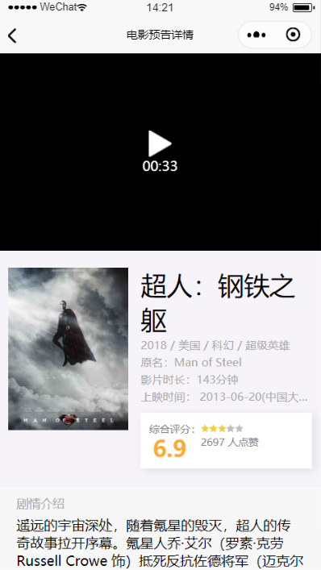
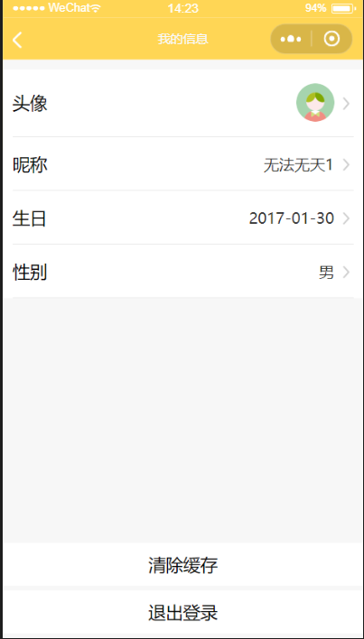

# 超英影视预告小程序

## 相关介绍
影视预告小程序，基于uni-app框架编写，只兼容了微信小程序。
前后端分离项目，前端显示数据均由后端提供。
## 编译命令
```
加载项目所需插件
npm install

预览项目
npm run dev:mp-weixin

编译项目
npm run build:mp-weixin
```

## 项目预览
* 首页：包含预告电影的轮播图，热门电影评分，预告片，和推送。可点击热门进入预告详情页。



* 搜索页：默认出现热门预告，根据搜索关键词重新渲染页面显示。


* 详情页：预告的详情页，由首页或搜索页点击进入，包含预告短片、电影介绍、评分、收藏和演员照片及剧照。




* 个人：个人页面分登录和为登录两种，登录后可进入设置用户页面，设置头像、昵称、生日及性别。


